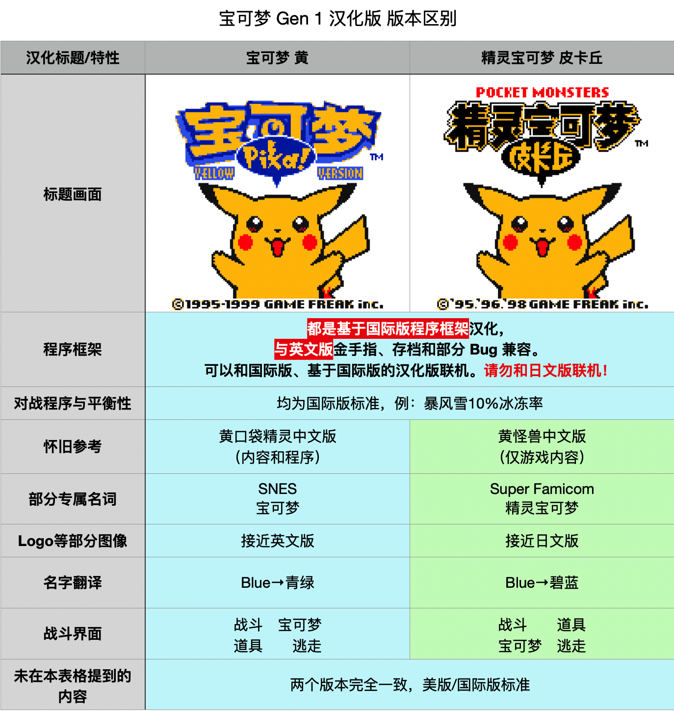

# 宝可梦 Gen 1 黄 汉化版 v1.0

[pret/pokeyellow 原始 README.md](README.O.md)

## 总结

- 忙完了韩版金银汉化版之后，总算是找到了更多人，大家一起填宝可梦汉化的最后几个坑～
- 此版本基于[「精灵宝可梦 红·绿·蓝 / 宝可梦 红·蓝」](https://github.com/TomJinW/pokeredCHS)新汉化工程汉化。

## 关于汉化版本
- 汉化版基于英文版「Pokemon Yellow Version」汉化。使用英文版对战框架，共用英文版金手指和部分Bug，可以和国际版Gen1/Gen2、CKN·口袋群星汉化版「皮卡丘/水晶」、韩版「宝可梦 金·银」、韩版「宝可梦 金·银」汉化版、新版「精灵宝可梦 红·绿·蓝 / 宝可梦 红·蓝」汉化版联机。**无法和日文版联机。**

- 本汉化版有两个版本，分为「宝可梦 黄」和「精灵宝可梦 皮卡丘」两个版本，版本间区别不大，两个版本的具体区别可以参考下表：

	
	
## 如何使用补丁
- 在 Github 上面的 Release 板块下面下载补丁并解压，其中 .ips 是ROM补丁，用于把原版游戏变成汉化版。而 .patch 是 3DS Virtual Console 修正补丁，用于在 3DS 上启用无线联机等功能。
- 前往 [https://www.marcrobledo.com/RomPatcher.js/](https://www.marcrobledo.com/RomPatcher.js/) 在网页上打补丁。
- 或者使用第三方工具比如 MultiPatch 等对 ROM 使用 ips 补丁。

## 关于补丁的使用范围

- 本项目仅提供 ips 补丁。打上补丁之后原版会变成汉化版。
- 关于 ips 补丁文件的信息：

|**补丁文件名**|**用于汉化**|**需要原始文件**|**原始文件 MD5**|
|:---:|:----:|:----:|:----:|
|US.pokeyellow.ips| 「宝可梦 黄」|英文版「宝可梦 黄」| d9290db87b1f0a23b89f99ee4469e34b |
|SJP.pokeyellow.ips| 「精灵宝可梦 皮卡丘」|英文版「宝可梦 黄」| d9290db87b1f0a23b89f99ee4469e34b |

## 新增相比原版的改动内容
- 修复了 MissingNo. 会损坏名人堂数据的 Bug。

## 兼容性与联动状况

### 兼容性：

- 黑白机兼容性： 
 
	| 初代 Game Boy | Game Boy Pocket | Game Boy Light | Super Game Boy (2)|
	|:-----:|:----:|:----:|:----:|
	| ✅兼容 | ✅兼容 | ✅兼容 | ✅兼容 |

	
- 彩机兼容性：
		
	|Game Boy Color|Game Boy Advance (SP)|Game Boy Player|Game Boy Micro|
	|:-----:|:----:|:----:|:----:|
	| ✅兼容 | ✅兼容 | ✅兼容 | ❌不兼容 |

	- Game Boy Micro 和 Nintendo DS 家族不兼容 Game Boy 和 Game Boy Color 游戏。

 

### 存档迁移兼容性，用于需要从其他版本转移存档：

| 从本汉化版/国际版迁移 | 从CKN·群星汉化版迁移 | 从日版游戏迁移 |
|:-----:|:----:|:----:|
| ✅可以迁移 | ⚠️需要注意| ❌无法迁移 |
	
- 可以迁移本汉化版（旧版）和国际版存档。建议在宝可梦中心门口垫子处存档后，
再迁移存档，迁移存档后立即出门再次存档，避免游戏死机。具体操作方法如下：
	1. 开始操作前，备份好旧版本游戏目录下的所有文件。
	2. 打开旧版本游戏，在任意的宝可梦中心门口垫子处，使用「记录」功能保存。
	3. 将新游戏 ROM 名字修改为与旧版本一致后，直接粘贴覆盖旧版本的游戏ROM。
	4. 打开游戏，选择「继续游戏」，之后立即出门再次使用「记录」，完成迁移。
	5. 如果迁移后新游戏内读取存档死机，可以携带会飞翔的宝可梦，在任意精灵中心门口处存档后迁移，新版读取存档后立刻使用飞翔飞到其他地方。

-  因内部编码不同，从CKN·口袋群星汉化版「精灵宝可梦 皮卡丘」v1.0/v1.1 迁移存档时，**需要使用额外存档转换工具将编码转换成新版游戏编码**。工具会包含在 Release 板块内的补丁中，也可以[前往这里](https://github.com/TomJinW/CKNSaveConverter)另行下载。

 

### 游戏内联机相关： 

- 如果要在 Nintendo 3DS Virtual Console 实现无线联机，不光要遵从以下限制，还有和 Virtual Console 相关的条件需要满足才能实现无线联机。
		
- 与本世代联机：
	
	|功能| 和本汉化版/和国际版 | 和CKN·群星汉化版「黄」v1.1 |和日版 | 
	|:-----:|:----:|:----:|:----:|
	| 交换宝可梦 | ✅可以联机1 | ✅可以联机 |❌无法联机|
	| 对战 | ✅可以联机1 | ✅可以联机|❌无法联机 |
	
	
	- 1：和国际版联机时，部分 UI 会截断过长宝可梦的昵称。
	- **无法和日版联机，强行和日版联机可能会有损坏存档的风险，请勿尝试。**

- 	与第二世代联机（时光胶囊）：
	
	| 和国际版 |和CKN·群星汉化版「水晶」|和日版 | 
	|:-----:|:----:|:----:|
	 ✅可以联机1 | ✅可以联机 |❌无法联机|
	- 1：和国际版（不含韩版）联机时，部分 UI 会截断过长宝可梦的昵称。
	- 1：和韩版以及韩版汉化版联机时，宝可梦/训练家名字显示异常但不影响基本功能。韩文/中文会乱码，过长的英文名可能会截断。可以使用英文字符以保证最大的兼容性。
	- 1：和韩版联机时，下列字符会让本汉化版出现异常行为，请在韩版中规避以下字符：
	
			-  덥 로 벗 셰 엎 죔 층 팡 힝 갠 꿨 도 룟 볕 쇔 영 쥔 캔 펙
			
	- **无法和日版联机，强行和日版联机可能会有损坏存档的风险，请勿尝试。**
	
 

### 3DS Virtual Console 联动相关：

- 3DS Virtual Console 通过给原版打补丁的形式对 ROM 进行修正，从而在游戏内启动联机功能时，在 3DS 系统中开启无线联机的菜单。
- 有关 Virtual Console 补丁文件的说明：

 |**补丁文件名**|**用于**|
|:---:|:---:|
|US.pokeyelllow.patch| 「宝可梦 黄」汉化|
|SJP.pokeyelllow.patch| 「精灵宝可梦 皮卡丘」汉化|

- 若要自行制作可以联机的 3DS Virtual Console，五个版本的汉化版均可以使用任意一个官方国际版本的 Gen 1 宝可梦 Virtual Console 替换 VC 内的 ROM 和对应的 VC .patch 补丁。
	
	| Title ID   Product Code | 红 | 蓝 | 黄 | 绿 |
	|:---:|:----:|:----:|:----:|:----:|
	|英语版|0004000000171000 CTR-P-RCQA|0004000000171100 CTR-P-RCRA|0004000000171200 CTR-P-QBFA|N/A|
	|法语版|0004000000171300 CTR-P-RCSA|0004000000171400 CTR-P-RCTA|0004000000171500 CTR-P-QBGA|N/A|
	|德语版|0004000000171600 CTR-P-RCUA|0004000000171700 CTR-P-RCVA|0004000000171800 CTR-P-QBHA|N/A|
	|西语版|0004000000171900 CTR-P-RCWA|0004000000171A00 CTR-P-RCXA|0004000000171B00 CTR-P-QBJA|N/A|
	|意语版|0004000000171C00 CTR-P-RCYA|0004000000171D00 CTR-P-RCZA|0004000000171E00 CTR-P-QBKA|N/A|
	- 不推荐使用日文版 VC 为底，使用日文版 VC，将无法支持「宝可梦虚拟传送」，无法和其他国际版 3DS Virtual Console 进行无线联机。
			
 

- 不同区域的套壳 3DS VC 在搜索房间时会有兼容限制，如果套壳区域不对应的话，在搜索房间时会无法搜索到对方。此外「宝可梦虚拟银行」也对 3DS VC 套壳的地区版本有要求，要求如下：

	| 是否可以在 VC 无线联机时  创建房间·加入到对方房间 | 本汉化版套壳国际版 Virtual Console| 
 	|:---:|:----:|
	|与国际版 Gen 1 VC 联动|✅可以|
	|与国际版（不含韩版） Gen 2 VC 游戏联动（时光胶囊）|✅可以|
	|与美版套壳的韩版金银汉化版联动（时光胶囊）|✅可以|
	|与韩版套壳的韩版金银汉化版联动（时光胶囊）|❌不能|
	|与韩版的 VC Gen 2 游戏联动（时光胶囊）|❌不能|
	|与 CKN 汉化版「黄」VC 联动1|❌不能|
	|与 CKN 汉化版「水晶」VC 联动（时光胶囊）2|❌不能|
	|**兼容状况**| | |
	|「宝可梦虚拟银行」和「宝可梦虚拟传送」|✅可以找到存档 可以传送|	
	- 1: CKN 汉化版由于改动了 ROM 的基础结构，官方的 Virtual Console 联机补丁不适用于 CKN 汉化版。
	- 2: 民间有 CKN「水晶」VC 联机补丁，经测试仍无法和 CKN「水晶」以外版本的 VC 联机。
	- 在「宝可梦虚拟传送」中，要传送的宝可梦的语言属性由 VC 的 Title ID 决定。
	
### 其他联动相关： 

- 与英文版 N64 游戏「Pokemon Stadium」/ 「Pokemon Stadium 2」联动：

	|功能| 联动状况| 
	|:-----:|:----:|
	| 读取存档（登记参战队伍） | ✅兼容 | 
	| 写回存档（整理盒子） | ⚠️需要注意 | 
	| GB Tower | ⚠️需要注意 | 

	- ✅：可以读取存档，可以把宝可登记到 N64 游戏内的参赛队伍中，需要注意 N64 游戏不支持显示中文名字。
	- ⚠️：如果使用了 N64 游戏内，「Prof. Oak's Lab」的整理宝可梦/盒子等功能，将存档写回 Game Boy 卡带时，N64 游戏内操作过的宝可梦的中文昵称会全部被破坏，在 Game Boy上无法正常显示。中文初训家名称不受影响。如有需要，请使用英文宝可梦昵称。
	-  ⚠️：「Pokemon Stadium」：GB Tower 功能在模拟器内未通过测试。
	-  ⚠️：「Pokemon Stadium 2」：GB Tower 功能在模拟器内通过测试。

- 与日文版 N64 游戏「ポケモンスタジアム」/「ポケモンスタジアム２」/ 「ポケモンスタジアム金銀」联动：❌不兼容。

 

## 如何从源代码编译 ROM
- [请参考这里](README.build.md)

## 「汉化组」成员列表

汉化制作人员：
* 程序：星夜之幻、TomJinW
* 翻译：吃馍法师、无敌阿尔宙斯、夜灵的天空、TomJinW
* 汉化工具：robertking、TomJinW
* 美工：卧看微尘、小光、TomJinW
* 测试：无敌阿尔宙斯、小光、NELO、TomJinW、SYLVEON、colorcat

## 鸣谢
- [任天堂](https://www.nintendo.co.jp)、[Game Freak](https://www.gamefreak.co.jp)、[Creatures](https://www.creatures.co.jp/)、[The Pokemon Company](https://corporate.pokemon.co.jp)

- [神奇宝贝百科](https://wiki.52poke.com/) [Bulbapedia](bulbapedia.bulbagarden.net) [tcrf.net](https://tcrf.net/Pokémon_Red_and_Blue)

## 开源协议声明
- 本项目使用来自[神奇宝贝百科](https://wiki.52poke.com/)的部分文本，并有部分修改。遵守[创作共用：署名-非商业性使用-相同方式共享协议](https://creativecommons.org/licenses/by-nc-sa/3.0/deed.zh)（https://creativecommons.org/licenses/by-nc-sa/3.0/deed.zh）。

